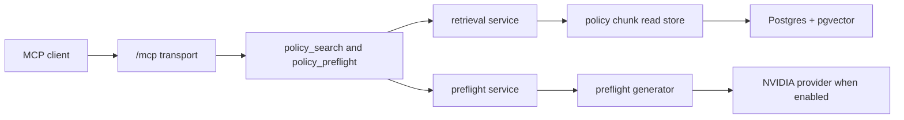

# Architecture

Java PolicyNIM is a single-module Spring Boot application. Package boundaries are kept explicit with ArchUnit while the project is still small.

## Runtime Flow

## Packages

- `io.policynim.config`: typed Spring configuration and MCP transport environment normalization
- `io.policynim.mcp`: hosted MCP transport, auth, tool definitions, readiness, and telemetry
- `io.policynim.policy`: markdown policy parsing, policy metadata, and deterministic chunking
- `io.policynim.ingest`: corpus loading and ingest orchestration
- `io.policynim.retrieval`: search request handling over embedded and reranked policy chunks
- `io.policynim.preflight`: grounded task guidance and citation materialization
- `io.policynim.provider`: provider interfaces and generated guidance contracts
- `io.policynim.provider.nvidia`: NVIDIA embedding, rerank, and chat-completions adapters
- `io.policynim.persistence.jdbc`: Flyway-backed JDBC storage over Postgres and pgvector

## Runtime Modes

The default profile is offline from live model providers. `policynim.provider.nvidia.enabled=false` keeps provider beans disabled, so local tests and CI do not need provider credentials.

Set `policynim.storage.mode=jdbc` with a configured Postgres datasource to serve search and preflight from persisted policy chunks. Keep `policynim.storage.mode=noop` for bootstrap and readiness-only runs.

## Public Surface

- `GET /livez` stays unauthenticated for lightweight liveness probes.
- `GET /healthz` stays unauthenticated for detailed readiness diagnostics.
- `/mcp` serves streamable HTTP MCP traffic by default.
- `policy_search` and `policy_preflight` are the stable tool names.
- Bearer auth is opt-in with `policynim.mcp.auth.enabled=true` and `POLICYNIM_MCP_BEARER_TOKEN`.
